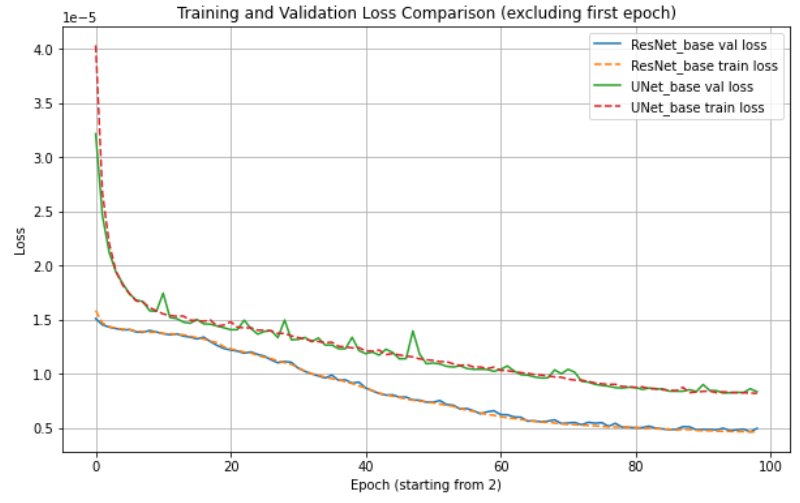
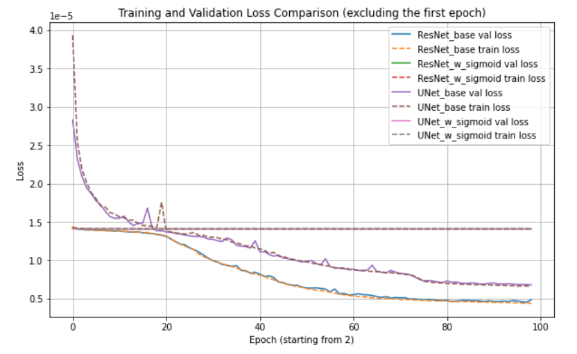
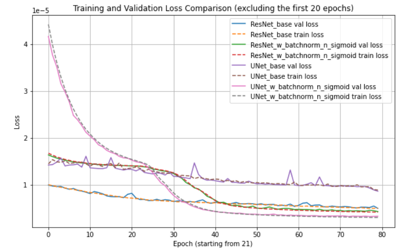
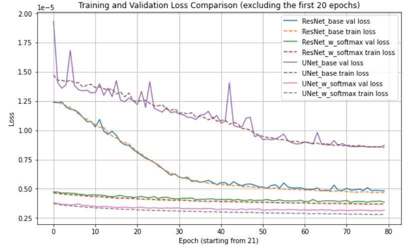
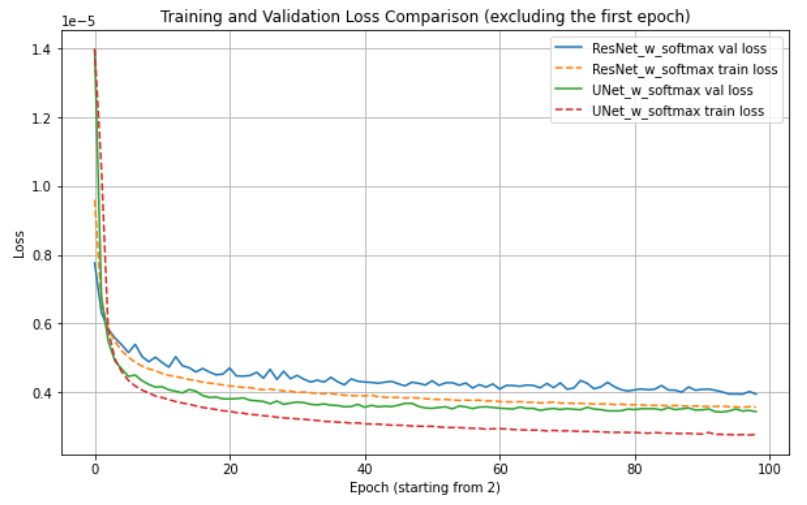
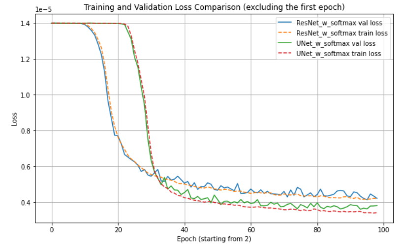

# Keypoint-Networks

## Introduction
Neural networks are commonly used in Formula Student to detect cone keypoints for improved distance estimation (see: [RektNet](https://arxiv.org/abs/2007.13971)).

This repository explores **lightweight neural network architectures** for keypoint heatmap prediction. I systematically evaluate the impact of design choices such as network architecture, optimizer, learning rate, batch size, normalization strategies, and output activations. All models are constrained to a **~80 KB memory footprint**, making them suitable for real-time embedded systems and enabling fair comparisons.

---

## Training Data
The models are trained on a subset of the **FSOCO dataset**, consisting of approximately 4,000 images of Formula Student cones. Images were resized to **64×48 pixels** and annotated with **7 keypoints per cone** using **Supervisely**.

Instead of predicting keypoint coordinates directly, the network predicts **heatmaps** for each keypoint. Direct coordinate regression is often unstable: small prediction errors can result in large coordinate jumps and weak gradient signals. It also performs poorly in out-of-distribution scenarios—when multiple locations are plausible, a regression model may output their average, producing meaningless predictions.

To address these issues, **Gaussian heatmaps** are used as training targets:
- They provide smoother and more informative supervision than single-pixel labels.
- They make training more tolerant to small localization errors and labeling noise, which is common in low-resolution or blurry images.

---

## Architectures

### ResNet
**ResNet (Residual Network)** is a convolutional architecture that introduces skip (residual) connections, allowing each block to learn a residual function instead of a direct mapping. These connections improve gradient flow, reduce training instability, and enable deeper networks to train effectively. Even in compact, lightweight models, ResNet helps extract meaningful features efficiently.

### U-Net
**U-Net** is an encoder–decoder architecture designed for dense, pixel-wise prediction tasks. The encoder captures semantic context through downsampling, while the decoder restores spatial resolution. Skip connections pass fine-grained spatial details from the encoder to the decoder, enabling precise localization while maintaining global context. This structure makes U-Net particularly effective for segmentation and keypoint heatmap prediction.

### Comparison
Although U-Net has a larger **receptive field**—meaning each output pixel can be influenced by a larger portion of the input image (approximately **30×30 pixels**)—compared to ResNet’s **15×15**, ResNet consistently performs better in this task. This suggests that, for small images and lightweight models, a very large receptive field is not always necessary. ResNet’s residual connections and efficient feature reuse allow it to localize keypoints more accurately despite its smaller receptive field.

---

## Other Design Choices

### Heatmaps vs. Coordinate Regression
Direct coordinate regression collapses localization into a single prediction per keypoint. This makes learning sensitive to small spatial errors and forces the model to output a single point even in ambiguous cases, often resulting in averaged, meaningless predictions. Heatmap-based approaches preserve spatial structure, provide dense supervision, and naturally allow multiple high-probability regions. Using Gaussian heatmaps further stabilizes training by rewarding predictions close to the ground truth rather than heavily penalizing small deviations.

---

### Batch Normalization
Batch normalization stabilizes training by normalizing layer activations within each mini-batch, addressing **internal covariate shift**—the continuous change in activation distributions during training. It improves gradient flow, allows higher learning rates, and acts as a regularizer. Its effectiveness depends on batch size, as very small batches can produce noisy statistics.

In practice, batch normalization provides a **stronger benefit for U-Net than for ResNet**. U-Net’s encoder–decoder structure and concatenated skip connections introduce larger variations in activation scale, particularly in the decoder. Batch normalization helps align these distributions, leading to more stable training. In contrast, ResNet’s residual connections already stabilize activation scales, making it less sensitive to normalization.

---

### Final Layer Activation Functions
Two output activations are explored:

- **Sigmoid** maps each output independently to the range [0, 1], allowing multiple high-probability regions per heatmap.
- **Softmax** converts values into a probability distribution that sums to 1, emphasizing a single dominant peak per keypoint channel.

Applying sigmoid **without batch normalization** causes both architectures to collapse to near-zero predictions. This occurs because unnormalized activations can push logits into strongly negative values at initialization, causing sigmoid to saturate and gradients to vanish.

Batch normalization prevents this by keeping activations near zero mean and unit variance, ensuring sigmoid operates in its high-gradient regime. With batch normalization enabled, U-Net combined with sigmoid outperforms all other configurations. U-Net benefits more from this combination because normalization mitigates scale mismatches introduced by encoder–decoder concatenations, whereas ResNet’s residual structure already provides inherent stabilization.

Softmax also yields a noticeable performance improvement by enforcing a clear spatial probability distribution per keypoint.

---

### Optimizers
Multiple optimizers (e.g., Adam, RMSProp) are evaluated to study their impact on convergence speed and final accuracy under tight model size constraints.

---

### Batch Size
**Batch size** determines how many samples are processed per forward/backward pass and affects training stability, convergence, and generalization:

- **Small batch sizes (4–16):**
  - Introduce noisy gradients that can improve generalization.
  - Can destabilize BatchNorm due to limited statistics.
  - Require less memory.

- **Large batch sizes (32–128):**
  - Produce smoother, more stable gradients.
  - Require more memory and may reduce generalization if too large.

Across a wide range of batch sizes and output activations (linear vs spatial softmax), performance differences were minimal. This indicates that the task is well-conditioned and that most configurations converge to similar solutions, with optimization choices primarily affecting training dynamics rather than final accuracy.

Batch size = 4  

Batch size = 64  

